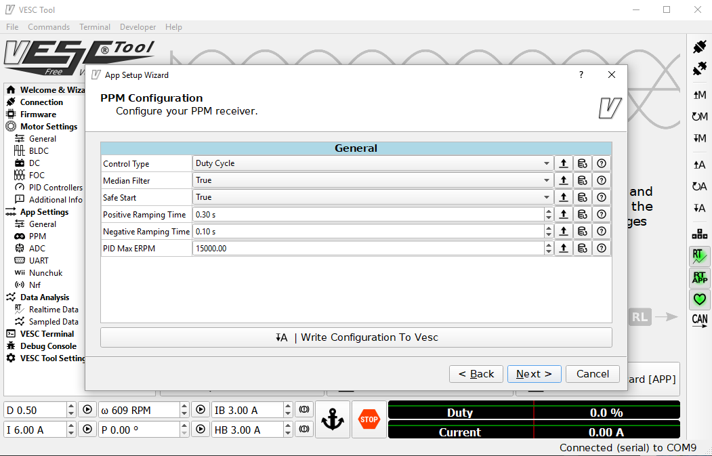

# Flipsky VESC 4.12 Documentation 

This is a documentation for how to use and configure the flipSky FSESC 4.12 used on the MOMObot. The exact store page can be found [here](<https://flipsky.net/products/torque-esc-vesc-%C2%AE-bldc-electronic-speed-controller> ). 

## Introduction

Vedder Electronic Speed Controller (VESC) is a highly configurable (largely) open source ESC that sees a wide variety of applications by hobbyists in the electric scooter or skateboard domain. This makes VESC a suitable ESC for MOMObot as it uses scooter motors for movement. VESC is an excellent choice for hobby robotics of this scale as it is:

- Highly configurable with both conventional BLDC control as well as FOC support
- Supports a wide variety of motors and configurations
- Self-tuning which allows even unmarked motors from Aliexpress or Taobao to be calibrated properly
- Generally has an internal BEC, MOSFET and etc which makes it an all in one package 
- Able to control motors using PPM, analog, UART, I2C, USB, CAN-bus
- Effective even with sensorless motors
- Small and light for what it can achieve


## Flipsky VESC 4.12

The Flipsky VESC 4.12 is a surprisingly robust product that does not require a laboratory power supply for first start configuration (contrary to some VESC guides on the internet). Despite being made in China, it offers reliable performance that matches some of the more expensive ESCs on the market. It is also one of the few remaining VESC providers that has remained backward compatible with the open source VESC software (many providers have converted the VESC stack to a more proprietary one).

### Firmware

Flipsky VESC 4.12 has a hardware version of 4.12 and a software version of 3.4. This means only specific version of VESC tools can be used with the ESC. Because of the finicky nature of download links on the internet (as well as some requiring registration), I have uploaded the specific VESC tool (windows) proven to work with the Flipsky VESC 4.12 [here](https://drive.google.com/file/d/1Co-ZkWsYtM6cXchykglwBf2F281r1QB_/view?usp=sharing). The exact version is VESC tool version 0.95.

### Specifications

- Hardware: v4.12
- Firmware: v3.40
- PCB: 4 layers, size: 40*60mm
- Current: 50A continuous / 240A peak
- Voltage: 8V-60V (cells: 3-13S LiPo)
- Recommended: 10S battery
- BEC 5V@1.5A
- BEC type: Internal driver support
- Timing: Software Calibration
- Motor control interface: PPM signal (RC servo), analog, UART, I2C,    USB or CAN‐bus
- Cutoff Voltage: Programmable
- Frequency: PWM Input
- Governor: No
- Weight: 80g
- FSESC4.12 Size: 60x40x20mm
- Programming card: No
- Reverse Direction support: Yes

### Connections


## Software Setup

### Motor Connection and Setup

Some information was referenced from the [Motor Wizard Guide](<https://cdn.shopify.com/s/files/1/0011/4039/1996/files/Motor_Setup_Wizard.pdf?11313553160569203029> ).

1. Start ```vesc_tool_0.95.exe``` in administrator mode

   - VESC Tool will prompt to update, don't update

2. The tool should look like this:

   

3. Plug in the one of the Flipsky VESCs to the computer via mini-USB cable. 

4. Click on the connection icon in the top right corner.

   - If prompted to update the software of the VESC, proceed to update

5. Alternatively, click on the ```connection``` tab in the left menu and select ```Autoconnect```:

   

6. The VESC should now have a lit green LED. If there isn't a lit LED, check if the drive has been installed correctly or if the product is defective

7. The motor setup wizard should appear, follow the steps accordingly

   

8. In our case, we will be selecting Field Oriented Control (FOC):

   

9. Under the motor setup wizard, enter the following parameters for the scooter motors used by the MOMObot:

   - Motor Current Max: 20A
   - Motor Current Max Brake: -20A
   - Battery Current Max: 60A
   - Battery Current Max Regen: -20A

10. Under the battery cutoff voltage wizard, just enter the correct number of cells (12S) and ensure that Lithium Ion is selected. 

    - Click on ```Apply``` and the battery voltage settings will be set automatically

11. In the sensor mode, select ```Hall Sensors```

12. Prop up the robot such that the wheels are not touching the ground (ensure that the wheels are attached to ensure the correct loading on the motors). 

13. Proceed to the FOC settings wizard:

    

    - Press the RL button, the motor will begin to vibrate

    - Then press the lamba button, the motor will begin to spin

    - After all red boxes turn green (indicating that VESC has detected the motor parameters), click on ```apply``` to apply the motor values.

      

14. Under the Hall Sensor Detection wizard, ensure the motors can rotate freely

    - Then hit the play button
    - After the motors rotate and all the Hall sensor values have been detected, click `apply`

15. Finish the motor setup wizard


### App Settings

Next the app settings has to be configured accordingly. For MOMO control, we will be using PPM directly from the Teensy. Information for configuring VESC for RC can be found at the [RC configuration guide](<https://cdn.shopify.com/s/files/1/0011/4039/1996/files/Input_Setup_Wizard_for_single_VESC_using_a_PPM_signal_radio_controller.pdf?11313553160569203029> ).

1. Navigate to the `App Settings` in the left menu and select `Input Setup Wizard` at the bottom.

2. Configure the general app settings as follows:

   

3. Configure the PPM settings as follows:

   

   -  Alternatively, using ROS / Teensy, send a neutral signal and monitor what PPM is being detected and use that as the center instead. Then apply the maximum forward and reverse and use those as the start and end values accordingly.

4. Finally, set the Duty Settings as follows:

   

5. Remember to write the configuration to the VESC


That's it! The VESC should be configured for FOC.