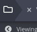
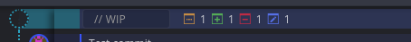
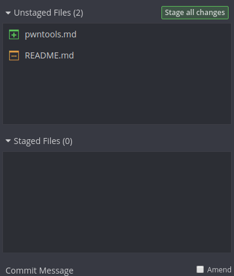
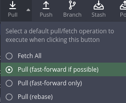

# 02 Git In-Depth

Author: Fasermaler

This sub-guide will cover Git concepts in greater depth. Additionally, it will also cover the use of GitKraken and Git Commands.

## Pre-requisites

- Basic bash knowledge
- Interest in learning how to *git gud*

## Introduction

While GitHub itself is very user friendly, the true power of Git lies in being able to work on a local version of a Git Repository. To do this would require greater knowledge of Git concepts and as well as the use of the Git Command Line or a GUI like GitKraken.

In this guide, we will cover Git concepts in greater depth and how to conduct them in command line or via GitKraken. The sections will cover the concept, followed by command line before GitKraken to allow the reader to greater appreciate the simplicity of Git Kraken.

## Repository

What is a repository? A repository (also known as a *repo*) is a basically a Git workspace. This is where working code can be found, *cloned* (downloaded) from and changes can be made by *committing* them. Ideally a Git repository contains the full working version of the code - such that at any point of time, the *origin* or *master* branch can be run as the latest stable version of the code.

Relative to your workstation, there is a single *local* repository in the HDD. Every other repository (on the internet, on another person's computer) is referred to as a *remote* repository.

### Initialize a Repository (CLI)

The first way to create a new repository is to simply initialize a local repository. Simply navigate to the directory you want and call the following command:

```bash
$ git init
```

This will tell git to create a hidden `.git` folder that stores all information about the git repository. In-depth information on how the `.git` folder will be covered later.

### Clone a Remote Repository (CLI)

The other method is to clone a remote repository:

```shell
$ git clone <addresss>
```

The address can be a github URL of the **main workspace directory** or you can SSH to another machine to get someone else's git repository.

Examples of addresses:

```shell
$ git clone https://github.com/Fasermaler/coding-notes # clone my coding notes repo!

$ git clone ssh://somemachine/path/to/git/foo.git # clone a repo over ssh
```

### Recurse Submodules

Initialize submodules upon initialization:

```shell
$ git clone --recurse-submodules <address> 
```

### Set Target Directory

```shell
$ git clone <address> <directory> # clones the repo into a new directory
```

#### Set Branch

Set the branch of the cloned repository:

```shell
$ git clone -b <branch-name> <address> 
```

### Set Origin

Set an origin other than *origin*:

```shell
$ git clone -o <origin-name> <address>
```

### GitKraken

In GitKraken, managing repositories is simple:

1. Click on the folder icon in the top left hand corner

   

2. In the *repository management* window, you can 

   - Open any local repository
   - Clone a remote repository via URL or the various online repository hosts
   - Initialize a local or remote repository (you then have the option to immediately clone it into your local HDD)

3. When cloning a repository with submodules, GitKraken will ask if you would like to clone the submodules as well. If you choose *no*, you can add the submodules later in the left hand panel.

## Commit

A commit is the act of committing a change a local copy of the repository. Remember that no matter what, a branch will exist within a repository (in most cases the *origin* branch is the default). 

When you commit a change, you are simply telling Git that the changes you have made are worthy of creating a snapshot of the current iteration of the files you have changed. It does not affect the remote repository that everyone accesses. To do that you will have to *push* the changes.

### Check Status (CLI)

Check the current status of the repository. This will let you know if the repository is out of date, if there are existing commits and etc.

```shell
$ git status
```

Sample output of a clean repository:

```shell
On branch master
Your branch is up-to-date with 'origin/master'.
nothing to commit, working directory clean
```

### Stage Files (CLI)

Before files can be committed, they have to be *staged*. Staging is a process where the files required in the commit can be assembled and curated before the commit action actually takes place. This allows the developer to select which files actually get committed instead of having all new files be committed.

```shell
$ git add <file-name> # Add one file to the staging area

$ git add -A # Add all changes to the staging area

$ git rm -r <file-name> # Remove a file permanently from the repo 
```

### Check Staged Files (CLI)

These commands allow you to check what files have been staged if you lose track of them:

```shell
$ git diff # Gets the difference between staged files and workspace

$ git diff --name-only # Show only names of cached files

$ git diff --cached # Show changes between the index and your last commit

$ git diff --name-only --cached # Show names of cached files changed between index and last commit - nifty eh?
```

### Committing Staged Files (CLI)

Once everything is in order, proceed to commit the staged files:

```shell
$ git commit -m "<commit message>"
```

More guidelines on how to write commit messages will be provided later.

### GitKraken

In GitKraken, active changes are tracked at the top of the repository tree and labeled as `// WIP`:



Files are color coded for convenience:

- Orange: Modified files
- Green: Newly added files
- Red: Removed Files
- Blue: Renamed files

On the right panel, select the files to be staged and write the commit message.



If there are too many files, swapping to *Tree* mode (located at the top of the panel) would use a folder tree structure. Right click a folder to see more options such as staging all files within the folder.

When the commit is completed, the `// WIP` will be changed to the new commit (unless some files are not committed, then they will form the new `// WIP` commit).


The repository tree will reflect that the local *master* branch is ahead of the remote *master* branch.

Select *Push* in the toolbar on the top to push the commit. You should also *Pull* the latest changes before pushing the commit.

## Pull

Pull is exactly what it sounds like, pulling the latest changes for a repository. This means that Git will pull the latest changes from a remote repository and update your local repository.

In most cases there will only be one remote repository you are working with (usually on GitHub) and one working repository on your local HDD. But this might not be the case in larger projects. It is possible to pull changes from another team member or another fork.

### Command Line

```shell
$ git pull # Get changes for the current branch

$ git pull <origin> <branch> # Get changes from a specific branch from origin
```

The difference between `git pull` and having the extra options is that `git pull` will simply pull changes from the current active *remote* repository. While each extra option will specify which origin and branch to fetch changes from. 

For instance, if the current repository and branch you are working on is *local/feature1*, then calling `git pull` will (usually) pull changes from *origin/feature1*. But if you specific `git pull origin release1`, the changes will be pulled from the *origin* release1 branch instead.

### GitKraken

Pulling in GitKraken is as simple as pressing the *Pull* button on the toolbar. Though other options exist:



Fast-forwarding will be covered later in the Git workflow section. For now, the default option is fine.

## Pull Request

A pull request is a request for another remote repository to pull changes from from your own local repository. In essence, it is a request for another repository to accept changes you have made to the code. In open-source software development, it is used when you do not have access to the actual repository.

In internal production, pull-requests might be used to ensure that all changes are screened by the repository maintainer before anything gets changed in the production code. This can minimize the chances of people breaking the code or worse, destroying the production repository.

*Take note that pull and pull request are actually quite different from each other even though they sound similar*

Take note that to do a pull request from command line requires an extension called `hub` which will not be covered in this guide. 

In most cases you can issue a pull request directly via the GitHub UI. This will be covered in a later section.

## Push

After a *commit* a push is used to push changes to a remote repository. 

If there are conflicts - which means that the file has been modified while you were in the process of editing it, Git will fail to push. You can adopt to *Force Push* if you'd like to override the changes. More on dealing with conflicts later.

*Note: Always pull before pushing to get the latest version.*

**Warning: Force Push is a destructive action, it's use is not recommended. I have left it here for posterity.**

### Command Line

##### Push to Remembered Branch

```shell
$ git push # Push changes to the remembered repository
```

##### Push to Specific Branch

```shell
$ git push origin <branch-name> # Push changes to specific branch

$ git push -u origin <branch-name> # Push changes to specific branch and remember it
```

##### Delete Specific Branch

```shell
$ git push origin --delete <branch-name> # Delete a specific branch
```

## Branch 

If a repository is a tree, branches are the different versions of the working code. In the Git workflow, the *master* branch is reserved for working versions of the code, while other branches are used to modify the code, develop new features or fixed.

Unlike tree branches, branches in Git can be *merged* with each other. This allows the *master* branch to effectively be updated with new features or bug fixes when they are complete.

### Command Line

##### Create a Branch

```shell
$ git branch <branch-name>
```

##### Delete a Branch

```shell
$ git branch -d <branch-name>
```

##### Delete a Remote Branch

```shell
$ git push origin --delete <branch-name>
```

##### List Branches

```shell
$ git branch
```

### GitKraken

To create a branch in GitKraken, just right click any specific commit and select *Create Branch Here*. Then name the branch accordingly.

The branch will not be visualized until divergent commits have been made between the *master* branch and the new branch.

To delete a branch, click the small triple dotted area of a branch in the left-hand panel. Then select delete. This can be done for both local and remote branches.

## Checkout

A checkout is when you intend to swap to a specific branch. Unlike a normal tree, branches actually do not exists as separate files. Effectively each branch is a version of the same workspace - thus to get to the workspace you want, you checkout to a specific branch and it modifies your workspace accordingly.

### Command Line

##### Swap to a Branch

```shell
$ git checkout <branch-name>
```

##### Switch to the Branch last Checked Out

```shell
$ git checkout --
```

##### Create New Branch and Switch to It

```shell
$ git checkout -b <branch-name>
```

##### Clone a Remote Branch and Switch to it

```shell
$ git checkout -b  <branch-name> origin/<branch>
```

### GitKraken

To checkout a branch in GitKraken, simply double click the branch itself in the left panel. Clicking a branch in the remote repository will cause GitKraken to checkout the associated local branch.

## Merge

Merging is the act of combining 2 branches together and taking the aggregate of their changes. In general, this is done when a feature branch has completed implementation of a new feature and is ready to be merged with the main production code after testing. 

Merge conflicts may occur as the result of improper division of work, resulting in multiple local repositories modifying the same file. More on how to resolve conflicts later.

### Command Line

```shell
$ git merge <branch-name> # Merge a branch into the currently active branch

$ git merge <source-branch> <target-branch> # Specifies which 2 branches to merge
```

### GitKraken

To merge 2 branches, checkout into the branch you intend to merge to and then select the branch actions (triple dotted area) of branch you intend to merge from. Barring conflicts, the merge should be complete.

## Conclusion

Congratulations! You have learnt nearly everything essential to making Git a part and parcel of your everyday software development. Feel free to stop here - the next section will covered more advanced concepts that are situationally useful but will nonetheless broaden your understanding of Git if you choose to continue.