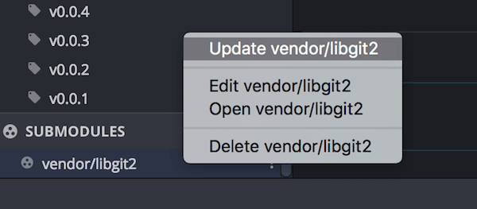

# Git Advanced Concepts

Author: Fasermaler

This guide covers more advanced concepts of Git and some references.

## Pre-requisites

- Knowledge of Git from the previous guides

## Advanced Concepts

The following are advanced concepts for those who are already comfortable with using Git. 

### Rebase

Rebase is a Git function that effectively rewrites history. It is the process of moving or combining a sequence of commits to a different base commit such that the base of a branch appears to have come from a different commit. However, the important thing to note is that a rebased branch, while looking the same, is comprised of an entirely new set of commits (which is evident from the commit ids). 

Here is a visualization of rebase:


#### Rebase Uses

Rebase is often used to maintain a linear (and by extension, clean) commit history. For instance, if a feature branch has been created off an older commit on the *develop* branch and now the *develop* branch has a new update or bug fix that should be incorporated into the feature branch. In this case, a rebase allows the feature branch to effectively be shifted down the *develop* commit history.

Rebasing should be used for integrating upstream changes into a local repository. It should not be used for public repository history as it would replace old commits with new ones and destroy a part of the project history. See the below section: Golden Rule of Rebasing for more details.

#### Golden Rule of Rebasing

Never do a git rebase on public branches.


What happens is that a rebase moves the commits in master to the tip of your feature. Unfortunately, everyone else is still in the original master branch. As rebasing is based on creating new commits, your local master will be seen as divergent from everyone else's. The only way to resolve this is to re-merge the two master branches - but by then you have wasted lots of time and made people pretty displeased.

#### Merge vs Rebase

A common debate on Git usage arises from the difference between a merge and a rebase. These are two different approaches towards Git Pulling from the master repository. 

By default, `git pull` will cause a git merge between the local and master branches. 


This allows the individual branches to be preserved but it does mean that the commit history will be non-linear as every time a major upstream change has to be incorporated. This gets worse if the master commit history is active as the repository history will become a mess.

By contrast, `git pull --rebase` will pull the changes but rebase the entire feature branch on the latest master commit.


This results in a linear commit history and eliminates unnecessary merge commits. The downside is that there is a loss in feature history as well as the fact that rebase should not be used if it were to be in violation of the golden rule.

#### Command Line

Ensure that you have checked out into the desired branch for rebasing, then run:

```shell
$ git rebase <commit-reference>
```

Commit reference can be the commit ID, branch name (in this case the branch HEAD will be used) or a tag.

#### GitKraken

To rebase in GitKraken, ensure that you are in the desired branch. Then right click any commit in the repository tree and select to rebase into that specific commit.

Using the dropdown menu under the *Pull* button, it is also possible to select the git pull rebase option in GitKraken as well.

To read more about rebasing, check out the follow atlassian resources:

- [Git Rebase](https://www.atlassian.com/git/tutorials/rewriting-history/git-rebase)
- [Merging vs Rebasing](https://www.atlassian.com/git/tutorials/merging-vs-rebasing)

### Submodules

Submodules are simply other Git repositories that are imported into a repository as dependencies. This has the benefit of gaining pulling an updated version of a submodule. 

Submodules can be used to break a project into smaller parts. In most cases however, the choice to use submodules has been made up especially if the repository is cloned from a public source (they are pretty commonly used especially with the newfangled AI and deep learning stuff).

#### Command Line

##### Add Submodule

This will add a remote repository to the project. The default directory will be named the same as the repository. 

```shell
$ git submodule add <url>
```

There will now be a `.gitmodules` file that stores the submodule information.

```shell
[submodule "testsubmodule"]
	path = testsubmodule
	url = <url>
```

##### Get Submodule

In the event that newly cloned repository has no submodules initialized, the following commands should be run:

```shell
$ git submodule init

$ git submodule update
```

Alternatively, when cloning the main repository, add the `--recurse-submodules` flag. 

##### Update Submodule

Updating a submodule is pretty similar to working with a git repository except that it is necessary to navigate to the submodule directory first. Once there, call a git fetch and git merge:

```shell
$ git fetch 

$ git merge origin/master
```

For more information on using submodules via CLI, see the Git Documentation on [submodules](https://git-scm.com/book/en/v2/Git-Tools-Submodules).

#### GitKraken

In GitKraken, upon cloning a repository, you will be prompted if you would like to download submodules. Any skipped submodules can be initialized afterwards in the left side panel under the *submodules* tab.

##### Adding Submodules

To add submodules, simply select the green plus sign on the submodules tab:


##### Update Submodules

Right click a submodule and select update:



### Upstream

### Stash and Pop

### Gitignore

### .git folder

### Merge Conflicts


## Appendix

This section covers some topics that were not as important or were perhaps too wordy for the main document.

### Git Commands for Git Workflow

[In the event that you have to follow the git workflow without being able to use a GUI like GitKraken, this section shows how the branches can be managed with the use of git commands. The following command snippets are taken from Vincent Driessen's [original Git Workflow post](https://nvie.com/posts/a-successful-git-branching-model/) on nvie.

#### Feature Branches

Creating a feature branch off *develop* branch:

```shell
$ git checkout -b myfeature develop
Switched to a new branch "myfeature"
```

Incorporating a finished feature on *develop*:

```shell
$ git checkout develop
Switched to branch 'develop'
$ git merge --no-ff myfeature
Updating ea1b82a..05e9557
(Summary of changes)
$ git branch -d myfeature
Deleted branch myfeature (was 05e9557).
$ git push origin develop
```

Once again note the use of the `--no-ff` flag.

#### Release Branches

Creating a release branch off the *develop* branch:

```shell
$ git checkout -b release-1.2 develop
Switched to a new branch "release-1.2"
$ ./bump-version.sh 1.2
Files modified successfully, version bumped to 1.2.
$ git commit -a -m "Bumped version number to 1.2"
[release-1.2 74d9424] Bumped version number to 1.2
1 files changed, 1 insertions(+), 1 deletions(-)
```

In this example, a script called `./bump-version.sh` was used to make the necessary header changes to the source code to reflect the version changes. However, on your own the workflow for a change in version will vary from company to company or project to project.

Finish the release branch, merge it to *master* and tag the version:

```shell
$ git checkout master
Switched to branch 'master'
$ git merge --no-ff release-1.2
Merge made by recursive.
(Summary of changes)
$ git tag -a 1.2
```

Merge the release branch back to *develop* and delete the branch:

```shell
$ git checkout develop
Switched to branch 'develop'
$ git merge --no-ff release-1.2
Merge made by recursive.
(Summary of changes)
$ git branch -d release-1.2
Deleted branch release-1.2 (was ff452fe).
```

#### Hotfix Branch

Create the hotfix branch off *master*:

```shell
$ git checkout -b hotfix-1.2.1 master
Switched to a new branch "hotfix-1.2.1"
$ ./bump-version.sh 1.2.1
Files modified successfully, version bumped to 1.2.1.
$ git commit -a -m "Bumped version number to 1.2.1"
[hotfix-1.2.1 41e61bb] Bumped version number to 1.2.1
1 files changed, 1 insertions(+), 1 deletions(-)
```

Similarly, the version number was changed using a pre-made script. Actual changing of version and workflow will depend on user, project and company.

```shell
$ git commit -m "Fixed severe production problem"
[hotfix-1.2.1 abbe5d6] Fixed severe production problem
5 files changed, 32 insertions(+), 17 deletions(-)
```

Tag and update the *master* branch:

```shell
$ git checkout master
Switched to branch 'master'
$ git merge --no-ff hotfix-1.2.1
Merge made by recursive.
(Summary of changes)
$ git tag -a 1.2.1
```

Update the *develop* branch and remove the Hotfix branch:

```shell
$ git checkout develop
Switched to branch 'develop'
$ git merge --no-ff hotfix-1.2.1
Merge made by recursive.
(Summary of changes)
$ git branch -d hotfix-1.2.1
Deleted branch hotfix-1.2.1 (was abbe5d6).
```

## Hub

For those who are interested in next level command line git usage, an extension known as `hub` adds many powerful features such as:

- Send and manage Pull Requests from terminal
- Ability to script workflows for GitHub
- Push to multiple remotes at once

Find out more about hub [here](https://hub.github.com/).

