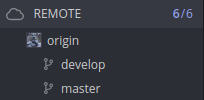
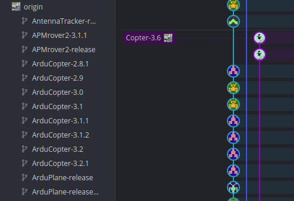
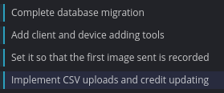
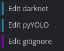
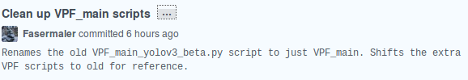
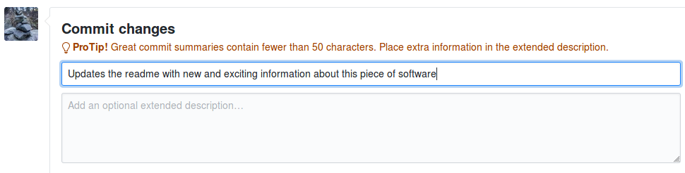
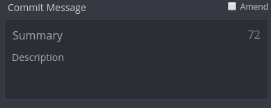
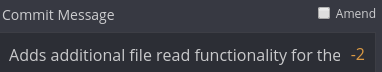

# Git

Author: Fasermaler

This guide will cover the basics of using Git and the Git workflow. It will also briefly cover GitKraken - a convenient utility that abstracts away the Git command line and assists developers in visualizing their repositories.

## Pre-requisites

- Basic bash knowledge
- Interest in learning how to *git gud*

## Introduction

Git is a version control framework that is widely used. You might have heard of GitHub - a thriving open source community where people share code and work together to improve each other's work. GitHub uses Git, **but Git does not actually require GitHub**. 

One of the big advantages of Git is that it is a Distributed Version Control System (DVCS). This means that instead of having a single computer / location that stores all the version control information, each computer working on a project can have their own full workspace that contains a working version of the code as well as all the changes (as long as they remember to fetch them).

Git is also optimized, fast and secure. Because of this, it has risen quickly to be adopted as the standard for version control - especially open-source version control. Git is quintessential as a software developer and learning it will augment your projects, big or small. 

One more thing to note: As you go through this guide, feel free to create a test repository to try out the various concepts and instructions. Experience with Git does not come by reading about it, it comes from actually **using Git as part and parcel of daily software development.**

## Git Basics 

The following section covers the basics of Git required to understand the workflow later. Feel free to skip it if you are familiar with the basics of how Git works.

This section also includes the relevant commands for each action. However, these actions can also be accomplished via a GUI in GitKraken.

### Repository

What is a repository? A repository (also known as a *repo*) is a basically a Git workspace. This is where working code can be found, *cloned* (downloaded) from and changes can be made by *committing* them. Ideally a Git repository contains the full working version of the code - such that at any point of time, the *origin* or *master* branch can be run as the latest stable version of the code.

Relative to your workstation, there is a single *local* repository in the HDD. Every other repository (on the internet, on another person's computer) is referred to as a *remote* repository.

#### Initialize a Repository (CLI)

The first way to create a new repository is to simply initialize a local repository. Simply navigate to the directory you want and call the following command:

```bash
$ git init
```

This will tell git to create a hidden `.git` folder that stores all information about the git repository. In-depth information on how the `.git` folder will be covered later.

#### Clone a Remote Repository (CLI)

The other method is to clone a remote repository:

```shell
$ git clone <addresss>
```

The address can be a github URL of the **main workspace directory** or you can SSH to another machine to get someone else's git repository.

Examples of addresses:

```shell
$ git clone https://github.com/Fasermaler/coding-notes # clone my coding notes repo!

$ git clone ssh://somemachine/path/to/git/foo.git # clone a repo over ssh
```

##### Recurse Submodules

Initialize submodules upon initialization:

```shell
$ git clone --recurse-submodules <address> 
```

##### Set Target Directory

```shell
$ git clone <address> <directory> # clones the repo into a new directory
```

##### Set Branch

Set the branch of the cloned repository:

```shell
$ git clone -b <branch-name> <address> 
```

##### Set Origin

Set an origin other than *origin*:

```shell
$ git clone -o <origin-name> <address>
```

#### GitKraken

In GitKraken, managing repositories is simple:

1. Click on the folder icon in the top left hand corner

   

2. In the *repository management* window, you can 
   - Open any local repository
   - Clone a remote repository via URL or the various online repository hosts
   - Initialize a local or remote repository (you then have the option to immediately clone it into your local HDD)

3. When cloning a repository with submodules, GitKraken will ask if you would like to clone the submodules as well. If you choose *no*, you can add the submodules later in the left hand panel.

### Commit

A commit is the act of committing a change a local copy of the repository. Remember that no matter what, a branch will exist within a repository (in most cases the *origin* branch is the default). 

When you commit a change, you are simply telling Git that the changes you have made are worthy of creating a snapshot of the current iteration of the files you have changed. It does not affect the remote repository that everyone accesses. To do that you will have to *push* the changes.

#### Command Line

The following are some snapshotting commands for managing files and committing them.

##### Check Status

Check the current status of the repository. This will let you know if the repository is out of date, if there are existing commits and etc.

```shell
$ git status
```

Sample output of a clean repository:

```shell
On branch master
Your branch is up-to-date with 'origin/master'.
nothing to commit, working directory clean
```

##### Stage Files

Before files can be committed, they have to be *staged*. Staging is a process where the files required in the commit can be assembled and curated before the commit action actually takes place. This allows the developer to select which files actually get committed instead of having all new files be committed.

```shell
$ git add <file-name> # Add one file to the staging area

$ git add -A # Add all changes to the staging area

$ git rm -r <file-name> # Remove a file permanently from the repo 
```

##### Check Staged Files

These commands allow you to check what files have been staged if you lose track of them:

```shell
$ git diff # Gets the difference between staged files and workspace

$ git diff --name-only # Show only names of cached files

$ git diff --cached # Show changes between the index and your last commit

$ git diff --name-only --cached # Show names of cached files changed between index and last commit - nifty eh?
```

##### Committing Staged Files

Once everything is in order, proceed to commit the staged files:

```shell
$ git commit -m "<commit message>"
```

More guidelines on how to write commit messages will be provided later.

#### GitKraken

In GitKraken, active changes are tracked at the top of the repository tree and labeled as `// WIP`:


Files are color coded for convenience:

- Orange: Modified files
- Green: Newly added files
- Red: Removed Files
- Blue: Renamed files

On the right panel, select the files to be staged and write the commit message.


If there are too many files, swapping to *Tree* mode (located at the top of the panel) would use a folder tree structure. Right click a folder to see more options such as staging all files within the folder.

When the commit is completed, the `// WIP` will be changed to the new commit (unless some files are not committed, then they will form the new `// WIP` commit).


The repository tree will reflect that the local *master* branch is ahead of the remote *master* branch.

Select *Push* in the toolbar on the top to push the commit. You should also *Pull* the latest changes before pushing the commit.

### Pull

Pull is exactly what it sounds like, pulling the latest changes for a repository. This means that Git will pull the latest changes from a remote repository and update your local repository.

In most cases there will only be one remote repository you are working with (usually on GitHub) and one working repository on your local HDD. But this might not be the case in larger projects. It is possible to pull changes from another team member or another fork.

#### Command Line

```shell
$ git pull # Get changes for the current branch

$ git pull <origin> <branch> # Get changes from a specific branch from origin
```

The difference between `git pull` and having the extra options is that `git pull` will simply pull changes from the current active *remote* repository. While each extra option will specify which origin and branch to fetch changes from. 

For instance, if the current repository and branch you are working on is *local/feature1*, then calling `git pull` will (usually) pull changes from *origin/feature1*. But if you specific `git pull origin release1`, the changes will be pulled from the *origin* release1 branch instead.

#### GitKraken

Pulling in GitKraken is as simple as pressing the *Pull* button on the toolbar. Though other options exist:


Fast-forwarding will be covered later in the Git workflow section. For now, the default option is fine.

### Pull Request

A pull request is a request for another remote repository to pull changes from from your own local repository. In essence, it is a request for another repository to accept changes you have made to the code. In open-source software development, it is used when you do not have access to the actual repository.

In internal production, pull-requests might be used to ensure that all changes are screened by the repository maintainer before anything gets changed in the production code. This can minimize the chances of people breaking the code or worse, destroying the production repository.

*Take note that pull and pull request are actually quite different from each other even though they sound similar*

Take note that to do a pull request from command line requires an extension called `hub` which will not be covered in this guide. 

In most cases you can issue a pull request directly via the GitHub UI. This will be covered in a later section.

#### Push

After a *commit* a push is used to push changes to a remote repository. 

If there are conflicts - which means that the file has been modified while you were in the process of editing it, Git will fail to push. You can adopt to *Force Push* if you'd like to override the changes. More on dealing with conflicts later.

*Note: Always pull before pushing to get the latest version.*

**Warning: Force Push is a destructive action, it's use is not recommended. I have left it here for posterity.**

#### Command Line

##### Push to Remembered Branch

```shell
$ git push # Push changes to the remembered repository
```

##### Push to Specific Branch

```shell
$ git push origin <branch-name> # Push changes to specific branch

$ git push -u origin <branch-name> # Push changes to specific branch and remember it
```

##### Delete Specific Branch

```shell
$ git push origin --delete <branch-name> # Delete a specific branch
```

### Branch 

If a repository is a tree, branches are the different versions of the working code. In the Git workflow, the *master* branch is reserved for working versions of the code, while other branches are used to modify the code, develop new features or fixed.

Unlike tree branches, branches in Git can be *merged* with each other. This allows the *master* branch to effectively be updated with new features or bug fixes when they are complete.

#### Command Line

##### Create a Branch

```shell
$ git branch <branch-name>
```

##### Delete a Branch

```shell
$ git branch -d <branch-name>
```

##### Delete a Remote Branch

```shell
$ git push origin --delete <branch-name>
```

##### List Branches

```shell
$ git branch
```

#### GitKraken

To create a branch in GitKraken, just right click any specific commit and select *Create Branch Here*. Then name the branch accordingly.

The branch will not be visualized until divergent commits have been made between the *master* branch and the new branch.

To delete a branch, click the small triple dotted area of a branch in the left-hand panel. Then select delete. This can be done for both local and remote branches.

### Checkout

A checkout is when you intend to swap to a specific branch. Unlike a normal tree, branches actually do not exists as separate files. Effectively each branch is a version of the same workspace - thus to get to the workspace you want, you checkout to a specific branch and it modifies your workspace accordingly.

#### Command Line

##### Swap to a Branch

```shell
$ git checkout <branch-name>
```

##### Switch to the Branch last Checked Out

```shell
$ git checkout --
```

##### Create New Branch and Switch to It

```shell
$ git checkout -b <branch-name>
```

##### Clone a Remote Branch and Switch to it

```shell
$ git checkout -b  <branch-name> origin/<branch>
```

#### GitKraken

To checkout a branch in GitKraken, simply double click the branch itself in the left panel. Clicking a branch in the remote repository will cause GitKraken to checkout the associated local branch.

### Merge

Merging is the act of combining 2 branches together and taking the aggregate of their changes. In general, this is done when a feature branch has completed implementation of a new feature and is ready to be merged with the main production code after testing. 

Merge conflicts may occur as the result of improper division of work, resulting in multiple local repositories modifying the same file. More on how to resolve conflicts later.

#### Command Line

```shell
$ git merge <branch-name> # Merge a branch into the currently active branch

$ git merge <source-branch> <target-branch> # Specifies which 2 branches to merge
```

#### GitKraken

To merge 2 branches, checkout into the branch you intend to merge to and then select the branch actions (triple dotted area) of branch you intend to merge from. Barring conflicts, the merge should be complete.

## Git Workflow

The Git workflow was conceived by [Vincent Driessen](https://nvie.com/posts/a-successful-git-branching-model/) on nvie back in 2010. In it, he proposed a now widely adopted approach to using Git to manage a repository, it's features and generally keeping things sane. Poor usage of Git can be highly destructive, thus before anyone delves into using Git itself, it is imperative that they understand how the overall workflow is supposed to work.

Below is what Vincent envisioned when he first drafted up the workflow:


In the previous image, the entire picture depicts a repository. The individual vertical lines (excluding the timeline) are individual *branches* of the repository.

This may all seem like a whole bunch of mumbo-jumbo at the moment but it will all become clear really soon.

### Decentralized Version Control

Leveraging on the decentralized nature of Git allows developers more flexibility in dealing with their workflow. However, in Vincent's workflow, Vincent proposed that the *origin* repository as the *ground truth* (AKA production repository). 

On top of each developer simply pushing and pulling from the *origin*, developers can form sub-teams who push and pull from each other. This allows multiple developers to work on a larger feature before pushing incomplete features to the *origin* branch.


### Main Branches

Vincent proposed two main branches - *master* and *develop* within the *origin* repository. If this sounds confusing to you, this is the hierarchy as visualized in GitKraken:



#### Master Branch

The *origin/master* branch is the production ready branch. This branch is reserved only for production-ready versions of the codebase. 

The *master* branch should only be merged to if the changes made are stable enough for production. In fact, by being strict enough such that each commit to the master branch is a production-ready version of the code, it is possible to use a Git hook script to automatically build and roll out each release version. 

#### Develop Branch

Running parallel to the *master* branch is the *origin/develop* branch. This branch is also known as the *integration* branch and is used to reflect the latest developmental changes to the code. This does not mean that broken or incomplete code is to be thrown here willy-nilly. This branch is for latest developments of complete features that might be unstable or require further development. However if someone else were to *clone* this repository they should **still be able to run the code.**

If it's hard to wrap your head around it, an analogy would be a beta branch of a game. The game still runs - it's just unstable. If the game can't even run, that change shouldn't be placed into the beta branch.

|                         | Master                | Develop                       |
| ----------------------- | --------------------- | ----------------------------- |
| Type of merge           | Production-ready code | Latest Developmental Features |
| Who merges?             | Repository Maintainer | Everyone / team leads         |
| Broken Code acceptable? | Hell no               | No                            |

### Supporting Branches

Supporting branches are other smaller branches that make it easier to manage the code before they make it back into the main branches. In smaller projects, they are often unnecessary. Nonetheless it's good to know these branches as they will become useful in larger projects. 

Supporting branches are not limited to one per type - multiple supporting branches of the same type can run concurrently with different purposes for different teams.

#### Feature Branches

May branch off:

- *develop*

Must merge back into:

- *develop*

Branch naming convention:

- Anything except: 
  - *master*
  - *develop*
  - *release-\**
  - *hotfix-\**

Feature branches (or topic branches) are used to develop a specific new feature. The ultimate end of this branch is to be merged in as a new feature to *develop* or to be discarded if the feature is not required. Feature branches should take into account the state of the *develop* branch lest the feature become impossible to merge back when it is complete.

Feature branches should exist within a developer's computer only and not in the *origin*.

When creating a feature branch, disable *fast-forward* so as to not lose any historical information on the contribution of the feature branch to the *develop* branch. This can be done by calling the `--no-ff` flag when doing a git merge:

```shell
git merge --no-ff feature_branch
```

(More on git commands later)

If GitKraken is used, the program will ask if you intend to fast forward during a merge or not.

The following allows you to visualize the loss in historical information:


Having the `--no-ff` flag allows for better rollback to the feature branch if the need arises.

#### Release Branches

May branch off:

- *develop*

Must merge back into:

- *develop* and *master*

Branch naming convention:

- *release-\**

The release branch is used to polish a *develop* state into a new release. In essence, it's use to dot the 'i's and cross the 't's of the code. This can be anything from removing debug messages to configuring the runtime parameters for a specific vendor. 

Only upon creation of a release branch does a version number get assigned to the release. This means that the *develop* branch never has a release number and is just in a perpetual state of development. The exact version number is up to version naming conventions or (in smaller projects) personal preference. As long as they as incremental and make a modicum of sense.

Here's an example of release branches for Arducopter - open-source drone firmware:



After a *release* branch is completed, it is merged with the *master* branch and tagged with the appropriate version number for easy reference.

After that, the *release* branch has to be merged back to the *develop* branch as well to keep the changes made during that branch. Once that is done, the *release* branch is usually deleted.

#### Hotfix Branch

May branch off:

- *master*

Must merge back into:

- *develop* and *master*

Branch naming convention:

- *hotfix-\**

A *hotfix* branch is a smaller and more explosive version of a *release* branch. They arise directly from production code that requires stamping out of a bug or code amendment. This extra branch allows people working on the *develop* branch to continue uninterrupted while a quick response force deals with fixing a critical bug in the production code.

When completed, the *hotfix* branch is to be merged into the *master* and *develop* branches.

**However, if there is a *release* branch active, the *hotfix* branch is to be merged into the *release* branch instead of *develop* branch. The changes will be propagated to *develop* once the *release* branch is complete.**

## Commit Messages

Commit messages deserves a subsection of it's own because they are the first thing people (or even yourself) will read when trying to understand the commit. Writing good commit messages is also essential in trying to get your pull request approved as a poor commit message will leave the repository maintainer confused as to intent and purpose of the pull request.

### Some Examples

Here is an example of a few git commit messages. What do you notice?



Everything is straight forward to understand and each commit's purpose is made clear.

Now here's another set of commit messages:



What does "edit" even mean? What has been changed? Anyone interested would have to open up the source files to check what features may or may not have been added.


Now this one is so long that even GitKraken could not fully show it.

### The Seven Rules of a Great Commit Message

The following have been taken from [Chris Beam's website](https://chris.beams.io/posts/git-commit/), though as he admits - this has all been said before time an again:

1. [Separate subject from body with a blank line](#rule1)
2. [Limit the subject line to 50 characters](#rule2)
3. [Capitalize the subject line](#rule3)
4. [Do not end the subject line with a period](#rule4)
5. [Use imperative mood in the subject line](#rule5)
6. [Wrap the body at 72 characters](#rule6)
7. [Use the body to explain *what* and *why* instead of *how*](#rule7)

#### 1. Separate subject from body with a blank line <a name="rule1"></a> 

As a rule of thumb, separate the subject of the commit with the body of the commit. This makes the commit messages much more readable whel called via `git log` or when browsing through the commit history on GitHub.

In GitKraken, the subject and body is divided into *Summary* and *Description* sections. A commit with both sections filled will look like this in the repository history on GitHub



The bolded text above it the *Summary* while the words in smaller font below form the *Description*.

#### 2. Limit the subject line to 50 characters <a name="rule2"></a> 

Keeping the subject line at 50 characters makes the commit history more readable and also forces the author to think about brevity. If the commit is on GitHub, GitHub itself will warn if a commit message gets too long:



#### 3. Capitalize the subject line <a name="rule3"></a> 

Simple enough, capitalize the subject line to make everything look better.

Example:

- Create docker image for version 1.4

Not:

- create docker image for version 1.4

#### 4. Do not end the subject line with a period <a name="rule4"></a> 

Another simple rule - additionally, using punctuation means using up 2% of the 50 character limit. 

Example:

- Add configuration generation script

Not:

- Add configuration generation script.

Additionally, if the commit message requires other punctuation like commas, semicolons and etc, it is probably too long.

#### 5. Use imperative mood in the subject line <a name="rule5"></a> 

Imperative mood means that that the messages should be written as if giving a command or instruction. This tends to make messages shorter and also follows the convention that Git uses imperative messages when doing commits on your behalf.

Examples:

- Add banana counting script
- Remove all global variables from utils.py

Not:

- Added banana counting script
- Removed all global variables from utils.py

If it helps, instead of thinking along the lines of "what have I added to the code?" (which is why people tend to write in past tense), think along the lines of "what will this change do to someone else's repository?"

- What I have done to the code: Added a banana counter (past tense)
- **What will this change do**: Add a banana counter (imperative mood)

Think along the latter, not the former.

*If you need more examples, the 7 rules have been written in imperative form*

#### 6. Wrap the body at 72 characters <a name="rule6"></a> 

This applies more for traditional CLI git commits. Because Git does not wrap text automatically, the lines will go on and on as far as the command line can stretch. Thus even in the body, remember to wrap the text once it hits 72 characters.

Once again this is not so applicable to GitKraken.

#### 7. Use the body to explain *what* and *why* instead of *how* <a name="rule7"></a> 

Commit messages should answer the question of what has been changed and why it has been changed. The question of how is self evident in the code. However, when maintaining large swaths of code, the usefulness of a commit is reliant on what it does and why it has to be done. 

This is used to saved time for everyone (including yourself in the future)

### Commit Messages in GitKraken

One great thing about using GitKraken is that it actively polices the 72 character limit:



While it is possible to go over the limit, GitKraken will make it clear that the commit message is now not within optimal conventions. 



It is still possible make the commit with the `-2` characters but you will not wallow in shame for disappointing the Git Gods.

## Advanced Concepts

The following are advanced concepts for those who are already comfortable with using Git. 

### Rebase

Rebase is a Git function that effectively rewrites history. It is the process of moving or combining a sequence of commits to a different base commit such that the base of a branch appears to have come from a different commit. However, the important thing to note is that a rebased branch, while looking the same, is comprised of an entirely new set of commits (which is evident from the commit ids). 

Here is a visualization of rebase:


#### Rebase Uses

Rebase is often used to maintain a linear (and by extension, clean) commit history. For instance, if a feature branch has been created off an older commit on the *develop* branch and now the *develop* branch has a new update or bug fix that should be incorporated into the feature branch. In this case, a rebase allows the feature branch to effectively be shifted down the *develop* commit history.

Rebasing should be used for integrating upstream changes into a local repository. It should not be used for public repository history as it would replace old commits with new ones and destroy a part of the project history. See the below section: Golden Rule of Rebasing for more details.

#### Golden Rule of Rebasing

Never do a git rebase on public branches.


What happens is that a rebase moves the commits in master to the tip of your feature. Unfortunately, everyone else is still in the original master branch. As rebasing is based on creating new commits, your local master will be seen as divergent from everyone else's. The only way to resolve this is to re-merge the two master branches - but by then you have wasted lots of time and made people pretty displeased.

#### Merge vs Rebase

A common debate on Git usage arises from the difference between a merge and a rebase. These are two different approaches towards Git Pulling from the master repository. 

By default, `git pull` will cause a git merge between the local and master branches. 


This allows the individual branches to be preserved but it does mean that the commit history will be non-linear as every time a major upstream change has to be incorporated. This gets worse if the master commit history is active as the repository history will become a mess.

By contrast, `git pull --rebase` will pull the changes but rebase the entire feature branch on the latest master commit.


This results in a linear commit history and eliminates unnecessary merge commits. The downside is that there is a loss in feature history as well as the fact that rebase should not be used if it were to be in violation of the golden rule.

#### Command Line

Ensure that you have checked out into the desired branch for rebasing, then run:

```shell
$ git rebase <commit-reference>
```

Commit reference can be the commit ID, branch name (in this case the branch HEAD will be used) or a tag.

#### GitKraken

To rebase in GitKraken, ensure that you are in the desired branch. Then right click any commit in the repository tree and select to rebase into that specific commit.

Using the dropdown menu under the *Pull* button, it is also possible to select the git pull rebase option in GitKraken as well.

To read more about rebasing, check out the follow atlassian resources:

- [Git Rebase](https://www.atlassian.com/git/tutorials/rewriting-history/git-rebase)
- [Merging vs Rebasing](https://www.atlassian.com/git/tutorials/merging-vs-rebasing)

### Submodules

Submodules are simply other Git repositories that are imported into a repository as dependencies. This has the benefit of gaining pulling an updated version of a submodule. 

Submodules can be used to break a project into smaller parts. In most cases however, the choice to use submodules has been made up especially if the repository is cloned from a public source (they are pretty commonly used especially with the newfangled AI and deep learning stuff).

#### Command Line

##### Add Submodule

This will add a remote repository to the project. The default directory will be named the same as the repository. 

```shell
$ git submodule add <url>
```

There will now be a `.gitmodules` file that stores the submodule information.

```shell
[submodule "testsubmodule"]
	path = testsubmodule
	url = <url>
```

##### Get Submodule

In the event that newly cloned repository has no submodules initialized, the following commands should be run:

```shell
$ git submodule init

$ git submodule update
```

Alternatively, when cloning the main repository, add the `--recurse-submodules` flag. 

##### Update Submodule

Updating a submodule is pretty similar to working with a git repository except that it is necessary to navigate to the submodule directory first. Once there, call a git fetch and git merge:

```shell
$ git fetch 

$ git merge origin/master
```

For more information on using submodules via CLI, see the Git Documentation on [submodules](https://git-scm.com/book/en/v2/Git-Tools-Submodules).

#### GitKraken

In GitKraken, upon cloning a repository, you will be prompted if you would like to download submodules. Any skipped submodules can be initialized afterwards in the left side panel under the *submodules* tab.

##### Adding Submodules

To add submodules, simply select the green plus sign on the submodules tab:


##### Update Submodules

Right click a submodule and select update:


### Upstream

### Stash and Pop

### Gitignore

### .git folder

### Merge Conflicts


## Appendix

This section covers some topics that were not as important or were perhaps too wordy for the main document.

### Git Commands for Git Workflow

[In the event that you have to follow the git workflow without being able to use a GUI like GitKraken, this section shows how the branches can be managed with the use of git commands. The following command snippets are taken from Vincent Driessen's [original Git Workflow post](https://nvie.com/posts/a-successful-git-branching-model/) on nvie.

#### Feature Branches

Creating a feature branch off *develop* branch:

```shell
$ git checkout -b myfeature develop
Switched to a new branch "myfeature"
```

Incorporating a finished feature on *develop*:

```shell
$ git checkout develop
Switched to branch 'develop'
$ git merge --no-ff myfeature
Updating ea1b82a..05e9557
(Summary of changes)
$ git branch -d myfeature
Deleted branch myfeature (was 05e9557).
$ git push origin develop
```

Once again note the use of the `--no-ff` flag.

#### Release Branches

Creating a release branch off the *develop* branch:

```shell
$ git checkout -b release-1.2 develop
Switched to a new branch "release-1.2"
$ ./bump-version.sh 1.2
Files modified successfully, version bumped to 1.2.
$ git commit -a -m "Bumped version number to 1.2"
[release-1.2 74d9424] Bumped version number to 1.2
1 files changed, 1 insertions(+), 1 deletions(-)
```

In this example, a script called `./bump-version.sh` was used to make the necessary header changes to the source code to reflect the version changes. However, on your own the workflow for a change in version will vary from company to company or project to project.

Finish the release branch, merge it to *master* and tag the version:

```shell
$ git checkout master
Switched to branch 'master'
$ git merge --no-ff release-1.2
Merge made by recursive.
(Summary of changes)
$ git tag -a 1.2
```

Merge the release branch back to *develop* and delete the branch:

```shell
$ git checkout develop
Switched to branch 'develop'
$ git merge --no-ff release-1.2
Merge made by recursive.
(Summary of changes)
$ git branch -d release-1.2
Deleted branch release-1.2 (was ff452fe).
```

#### Hotfix Branch

Create the hotfix branch off *master*:

```shell
$ git checkout -b hotfix-1.2.1 master
Switched to a new branch "hotfix-1.2.1"
$ ./bump-version.sh 1.2.1
Files modified successfully, version bumped to 1.2.1.
$ git commit -a -m "Bumped version number to 1.2.1"
[hotfix-1.2.1 41e61bb] Bumped version number to 1.2.1
1 files changed, 1 insertions(+), 1 deletions(-)
```

Similarly, the version number was changed using a pre-made script. Actual changing of version and workflow will depend on user, project and company.

```shell
$ git commit -m "Fixed severe production problem"
[hotfix-1.2.1 abbe5d6] Fixed severe production problem
5 files changed, 32 insertions(+), 17 deletions(-)
```

Tag and update the *master* branch:

```shell
$ git checkout master
Switched to branch 'master'
$ git merge --no-ff hotfix-1.2.1
Merge made by recursive.
(Summary of changes)
$ git tag -a 1.2.1
```

Update the *develop* branch and remove the Hotfix branch:

```shell
$ git checkout develop
Switched to branch 'develop'
$ git merge --no-ff hotfix-1.2.1
Merge made by recursive.
(Summary of changes)
$ git branch -d hotfix-1.2.1
Deleted branch hotfix-1.2.1 (was abbe5d6).
```

## Hub

For those who are interested in next level command line git usage, an extension known as `hub` adds many powerful features such as:

- Send and manage Pull Requests from terminal
- Ability to script workflows for GitHub
- Push to multiple remotes at once

Find out more about hub [here](https://hub.github.com/).